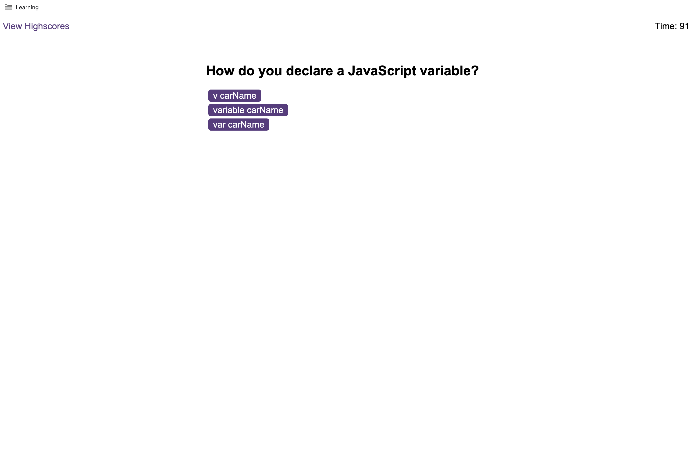

# JS-QUIZ

Timed quiz on JavaScript fundamentals that stores user initials + score, it also provide with leaderboards page to see top players sorted by score.

 ## Table of content

 During this project I worked with the following:

- [Description](#description)
  - [GitHub](#github)
  - [JavaScript](#javascript)
  - [Expected result](#expected-result)
  - [Result of project](#result-of-project)
  - [URLs](#urls)

# Description

In this challenge I used the Java Script language to create a js themed quiz time limited that contains the following requirements:

* A start button that when clicked a timer starts and the first question appears.
 
  * Questions contain buttons for each answer.
   
  * When answer is clicked, it shows and play specific audio if the answer is incorrect or correct and go to the next question.
  
  * If the answer clicked was incorrect then subtract -5 seconds from the timer.

* The quiz will end when all questions are answered or the timer reaches 0.

  * When the game ends, it's display their score and give the user the ability to save their initials and their score.

## GitHub 

I created a new GitHub repo called `JS-QUIZ` then executed the following steps:
- git clone
- copy starter files `.html`, `.js`, `.wav`.

## JavaScript

 I used JavaScript language to create both JS (score.js) and JS (logic.js) and worked with :
 - `variables`
 - `arrays`
 - `loop`:
     - `for` (to be able to iterate through an array).
 - `conditional`:
     - `if` (to perform different actions based on different conditions).
 - `methods`: 
     - `pop` (to remove items to the end of an array).
     - `play` (starts playing different audio for right/wrong answer).
     - `classlist.remove` (to remove a class name from an element with JavaScript).
     - `classlist.add` (to add a class name from an element with JavaScript).
     - `querrySelectorsAll` (to reload the current document).
     - `sort` (to sort array of elements by a criteria).
 - `DOM`    
     - `getElementById` (it is used almost every time you want to read or edit an HTML DOM element).
     - `createElement` (to create an element node).
     - `appendChild` (to append a node (element) as the last child of an element).
     - `addEventListener`(to attaches an event handler to a document).
     - `textContent`(sets or returns the text content of the specified node, and all its descendants).
 - `Web API - Browser`:
     - `JSON.parse` (to parse string data into object/array).
     - `JSON.stringify` (to convert object/array to string).
     - `Local Storage` (to store data like in database by key and be able to retrieve and persist it for later usage).

## Expected result

## Result of project
 
 
 
 
 
 

## URLs

* The URL of the deployed application.

https://alinakristy.github.io/JS-QUIZ/

* The URL of the GitHub repository. 

https://github.com/alinakristy/JS-QUIZ